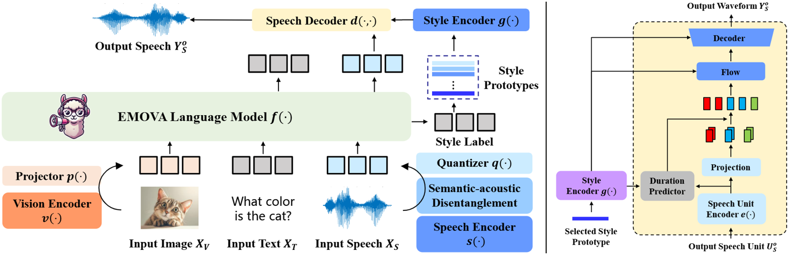

<div align="center">

</img>

# EMOVA Speech Tokenizer

🤗 [HuggingFace](https://huggingface.co/Emova-ollm/emova_speech_tokenizer_hf) | 💻 [EMOVA-Main-Repo](https://github.com/emova-ollm/EMOVA) | 📄 [EMOVA-Paper](https://arxiv.org/abs/2409.18042) | 🌐 [Project-Page](https://emova-ollm.github.io/)

</div>

This repository contains the implementation of the paper:

> EMOVA: Empowering Language Models to See, Hear and Speak with Vivid Emotions <br>
> [Kai Chen](https://kaichen1998.github.io/), [Yunhao Gou](https://gyhdog99.github.io/), [Runhui Huang](https://scholar.google.com/citations?user=B5zcj4wAAAAJ), [Zhili Liu](https://scholar.google.com/citations?user=FdR09jsAAAAJ), [Daxin Tan](https://www.linkedin.com/in/daxin-tan-b41870103/), [Jing Xu](), [Chunwei Wang](https://scholar.google.com/citations?user=yHxwwacAAAAJ), [Yi Zhu](https://yeezhu.github.io/), [Yihan Zeng](https://scholar.google.com/citations?user=YiDxCoAAAAAJ), [Kuo Yang](https://www.linkedin.com/in/kuo-yang/?originalSubdomain=hk), [Dingdong Wang](), [Kun Xiang](), [Haoyuan Li](), [Haoli Bai](https://haolibai.github.io/), [Jianhua Han](https://scholar.google.com/citations?user=OEPMQEMAAAAJ&hl=en), [Xiaohui Li](), [Weike Jin](https://scholar.google.com.hk/citations?user=ChSE_BAAAAAJ&hl=zh-CN), [Nian Xie](), [Yu Zhang](https://yuzhanghk.github.io/), [James T. Kwok](https://www.cse.ust.hk/~jamesk/), [Hengshuang Zhao](https://hszhao.github.io/), [Xiaodan Liang](https://lemondan.github.io/), [Dit-Yan Yeung](https://sites.google.com/view/dyyeung/home), [Xiao Chen](https://hk.linkedin.com/in/xiao-chen-065185167), [Zhenguo Li](https://scholar.google.com/citations?user=XboZC1AAAAAJ&hl=zh-CN), [Wei Zhang](), [Qun Liu](https://liuquncn.github.io/index_en.html), [Jun Yao](https://openreview.net/profile?id=~Jun_Yao2), [Lanqing Hong](https://scholar.google.com/citations?hl=zh-CN&user=2p7x6OUAAAAJ&view_op=list_works&sortby=pubdate), [Lu Hou](https://houlu369.github.io/), [Hang Xu](https://xuhangcn.github.io/) <br>
> *Computer Vision and Pattern Recognition Conference (CVPR), 2025.*

## Introduction

This repo contains the official speech tokenizer used to train the [EMOVA](https://emova-ollm.github.io/) series of models. With a semantic-acoustic disentangled design, it not only facilitates seamless omni-modal alignment among vision, language and speech modalities, but also empowers flexible speech style controls including speakers, emotions and pitches. We summarize its key advantages as:

- **Discrete speech tokenizer**: it contains a SPIRAL-based **speech-to-unit (S2U)** tokenizer to capture both phonetic and tonal information of input speeches, which is then discretized by a **finite scalar quantizater (FSQ)** into discrete speech units, and a VITS-based **unit-to-speech (U2S)** de-tokenizer to reconstruct speech signals from speech units.

- **Semantic-acoustic disentanglement**: to seamlessly align speech units with the highly semantic embedding space of LLMs, we opt for decoupling the **semantic contents** and **acoustic styles** of input speeches, and only the former are utilized to generate the speech tokens.

- **Biligunal tokenization**: EMOVA speech tokenizer supports both **Chinese** and **English** speech tokenization with the same speech codebook. 

- **Flexible speech style control**: thanks to the semantic-acoustic disentanglement, EMOVA speech tokenizer supports **24 speech style controls** (i.e., 2 speakers, 3 pitches, and 4 emotions). Check the [Usage](#usage) for more details.

<div align="center">
  </img>
</div>


## Installation

Clone this repo and create the EMOVA virtual environment with conda. Our code has been validated on **NVIDIA A800/H20 GPU & Ascend 910B3 NPU** servers. Other devices might be available as well.

1. Initialize the conda environment:

   ```bash
   git clone https://github.com/emova-ollm/EMOVA_speech_tokenizer.git
   conda create -n emova python=3.10 -y
   conda activate emova
   ```

2. Install the required packages (note that instructions are different from GPUs and NPUs):

   ```bash
   # upgrade pip and setuptools if necessary
   pip install -U pip setuptools

   cd emova_speech_tokenizer
   pip install -e . # for NVIDIA GPUs (e.g., A800 and H20)
   pip install -e .[npu] # OR for Ascend NPUS (e.g., 910B3)
   ```

## Usage

> [!NOTE]  
> Before this, remember to finish [Installation](#installation) first!

EMOVA speech tokenizer can be easily deployed using the 🤗 HuggingFace transformers API!

```python
import random
from transformers import AutoModel
import torch

## add if you want to use Ascend NPUs
# import torch_npu
# from torch_npu.contrib import transfer_to_npu

# load pretrained model
model = AutoModel.from_pretrained("Emova-ollm/emova_speech_tokenizer_hf", torch_dtype=torch.float32, trust_remote_code=True).eval().cuda()

# S2U
wav_file = "./examples/s2u/example.wav"
speech_unit = model.encode(wav_file)
print(speech_unit)

# U2S
emotion = random.choice(['angry', 'happy', 'neutral', 'sad'])
speed = random.choice(['normal', 'fast', 'slow'])
pitch = random.choice(['normal', 'high', 'low'])
gender = random.choice(['female', 'male'])
condition = f'gender-{gender}_emotion-{emotion}_speed-{speed}_pitch-{pitch}'

output_wav_file = f'./examples/u2s/{condition}_output.wav'
model.decode(speech_unit, condition=condition, output_wav_file=output_wav_file)
```

## Citation
If you find our model/code/paper helpful, please consider citing our papers and staring us!

```bibtex
@article{chen2024emova,
  title={Emova: Empowering language models to see, hear and speak with vivid emotions},
  author={Chen, Kai and Gou, Yunhao and Huang, Runhui and Liu, Zhili and Tan, Daxin and Xu, Jing and Wang, Chunwei and Zhu, Yi and Zeng, Yihan and Yang, Kuo and others},
  journal={arXiv preprint arXiv:2409.18042},
  year={2024}
}
```
